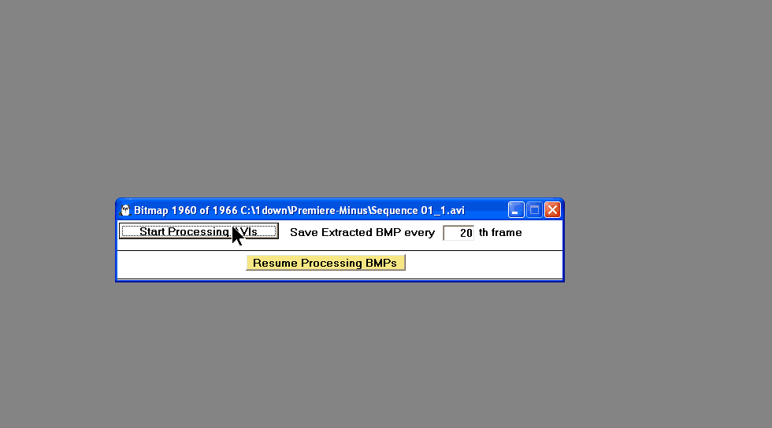



## Premiere Minus AVI Video Processing &amp; Effects

### Description

Minor upgrades: (03-28-08) Tweaked a few things, fixed a few errors. (3-24-08): Now compatible with my program (CaptureScreen2AVI-GIF-MPG txtCodeId=61619). Compile and copy all executables and dll's to the root directory of CaptureScreen2AVI-GIF and enjoy.

Major Update(07-22-07): Additional features have elevated this project into an Adobe Premiere like video processing utility. The interface has improved as the video frames can be viewed in a timeline, selected, processed with many effects, joined, split and saved as an AVI. I will try to write a help file soon...The program accepts multiple AVI (only and success may be contingent on the codec) files and will process them frame by frame. Disk consumption depends on the file size and resolution. Audio is not processed. I recommend small AVIs and/or limiting the number of frames captured. One may then join selected frames or all of the frames. The program accepts AVI's of different resolutions as well. One may also load a single avi and split out sections to write using a multiselect timeline. This is`based in part on Ray Mercers AVI code with some modifications. This utility compliments and will likely be incorporated in my Screen Capture program here on PSC.. Update(07-16-07): I've added the ability to apply effects (using AMAZING EFFECTS txtCodeId=55328, GraphicalDLL.dll; if you can't compile the C++ DLL, you may download it here: www.moosenose.com/GraphicalDLL.zip). Some minor bugs were fixed as well.---Update (08-25-07)---Interface improved, File backup and restore, Make animated GIF from edited video, Better selection features on timeline and view video with default avi viewing program. The Root.gif pictures shows which files should be in the root directory and the extra projects are included.---Update(08-29-07)---The program now prompts you for missing files and creates the directory structure. Sorry for the oversight and unfriendliness.
 
### More Info
 
avi file

avi file, animated gif, special effects.

             |
---                |---
**Submitted On**   |2008-03-28 01:29:02
**By**             |[Warren Goff](https://github.com/Planet-Source-Code/PSCIndex/blob/master/ByAuthor/warren-goff.md)
**Level**          |Intermediate
**User Rating**    |5.0 (25 globes from 5 users)
**Compatibility**  |VB 6\.0
**Category**       |[Graphics](https://github.com/Planet-Source-Code/PSCIndex/blob/master/ByCategory/graphics__1-46.md)
**World**          |[Visual Basic](https://github.com/Planet-Source-Code/PSCIndex/blob/master/ByWorld/visual-basic.md)
**Archive File**   |[Premiere\_M2107693282008\.zip](https://github.com/Planet-Source-Code/warren-goff-premiere-minus-avi-video-processing-amp-effects__1-68993/archive/master.zip)

